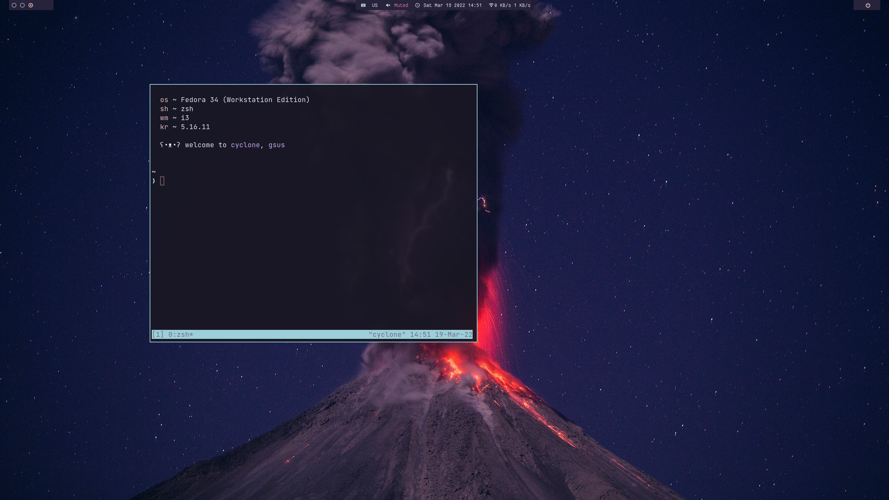
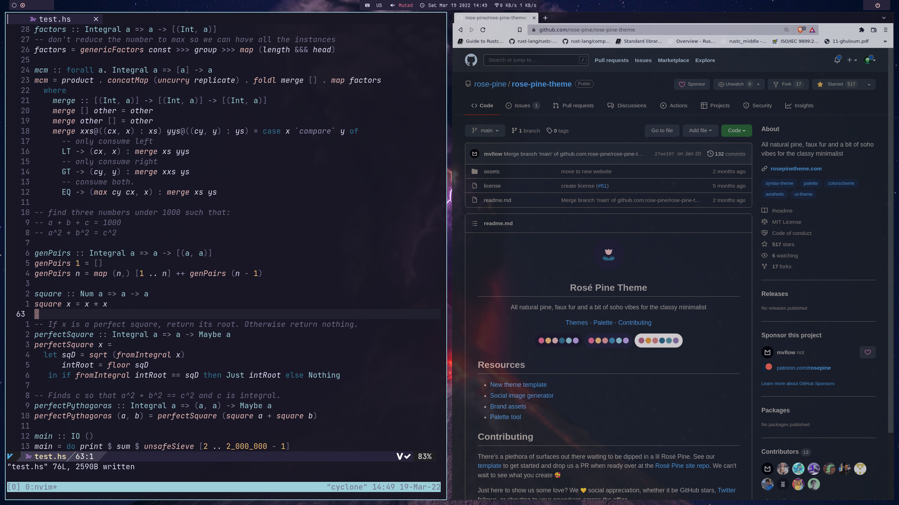

# dotfiles

Ah, home. Sweet home. And I'm not talking about your roof, but more specifically `$HOME`. This place is the one of the most disorganised places on a dev's
computer, only `/usr/lib` and `/usr/bin` cause more havoc. But it is indeed the most beloved one.

## How it looks

The theme is [based on rose-pine](https://rosepinetheme.com/).

## What is being used in the screenshot?

I try my best to keep my dotfiles simple and only put things that I'm currently using. Sadly, this is not always possible, specially in the case of window manager configuration,
so I'm going to list only the configurations relevant to the config from the screenshot:
  - [polybar](./polybar): The three bars at the top.
  - [i3](./i3): I'm using [i3-gaps](https://github.com/Airblader/i3) as my window manager. Don't forget to check out [rc](./rc) for the init scripts used by the configuration.
  - [alacritty](./alacritty): If you're not going to use `tmux`, remove the `shell` key and alacritty will use your default shell.
  - [neovim](./nvim): It is a submodule, so I'd init it if you want to try it. It's completely complementary, not needed for the looks
  - [zsh](./zsh): My current shell.
  - [picom](./picom): Even though I stopped using rounded corners, you might want to take a look at it.
  - [tmux](./tmux): Don't forget about tpm in `.tmux/plugins/tpm`, it is a necessary submodule if you want to have my tmux config. On first launch you will need to press `<prefix>+I` (shift included) so tpm can install the theme.
  - [starship prompt](./starship): Prompt configuration for the [starship project](https://starship.rs/)
  - [wallpaper](./wallpapers/.local/share/wallpapers/volcano.jpg): I got it from [alphacoders' website](https://wall.alphacoders.com/by_category.php?id=10&name=Earth+Wallpapers)

## Font

The font in polybar is `Fantasque Sans Mono`, the [Nerd Font](https://github.com/ryanoasis/nerd-fonts/tree/master/patched-fonts/FantasqueSansMono) variant. Everywhere, as far as I'm concerned.
The font in alacritty is `JetBrainsMono Nerd Font`, the same `nerd-fonts` repo.

## Tips 

To manage my dotfiles I switched to using [`stow`](https://www.gnu.org/software/stow/). ThePrimeagen does a great work on his [explanation video](https://www.youtube.com/watch?v=tkUllCAGs3c).

## I want to see gruvbox!

Switch to the [`gruvbox`](https://github.com/cybergsus/dotfiles/tree/gruvbox) branch.

## I want to see Nord again!

This summer I'll be working on the nord-themed side to merge it with this one, just with the color themes/wallpapers updated.
Meanwhile, this is the last [commit](https://github.com/cybergsus/dotfiles/tree/e39efa17255f65eaf3aa107485a33a1826a107fa) where I was still using Nord.
