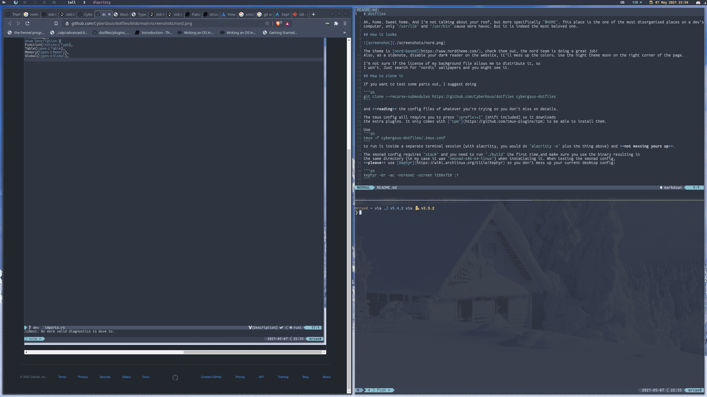

# dotfiles

Ah, home. Sweet home. And I'm not talking about your roof, but more specifically `$HOME`. This place is the one of the most disorganised places on a dev's
computer, only `/usr/lib` and `/usr/bin` cause more havoc. But it is indeed the most beloved one.

## Trying polybar

I've decided to start with [polybar](https://github.com/polybar/polybar). I downloaded [polybar themes](https://github.com/adi1090x/polybar-themes/tree/46154c5283861a6f0a440363d82c4febead3c818)
and customized the `material` variant to match the nord color palette,
and changed some modules. I'll be taking inspiration from various
sources, and I'll eventually settle in my own config.

## How it looks



The theme is [nord based](https://www.nordtheme.com/), check them out, the nord team is doing a great job!
Also, as a sidenote, disable your dark reader on the website, it'll mess up the colors. Use the night theme moon on the right corner of the page.

The wallpaper is from [this awesome person](https://raw.githubusercontent.com/Blu3Jive001/Wallpapers/master/Nordic/Simplistic/Minimal-Nord.png), 
under `Nordic/Simplistic/Minimal-Nord.png`.


## How to clone it

If you want to test some parts out, I suggest doing

```sh
git clone --recurse-submodules https://github.com/CyberGsus/dotfiles cybergsus-dotfiles
```

and **reading** the config files of whatever you're trying so you don't miss on details.

The tmux config will require you to press `<prefix>+I` (shift included) so it downloads
the extra plugins. It only comes with [`tpm`](https://github.com/tmux-plugins/tpm) to be able to install them.

Use
```sh
tmux -f cybergsus-dotfiles/.tmux.conf
```
to run it inside a separate terminal session (with alacritty, you would do `alacritty -e` plus the thing above) and **not messing yours up**.

## Tips 

For managing dots, I strongly recommend the [atlassian tutorial](https://www.atlassian.com/git/tutorials/dotfiles).
