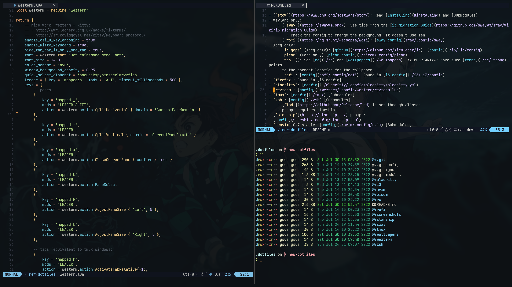

[Submodules]: #submodules


# dotfiles

This is *just* a backup for my current dotfiles. You can try them if you want,
but I won't provide any shortcuts. Please make sure to read stuff like keybinds
etc to make sure you're doing the correct thing.

## Screenshot

I only have the "productive" screensot since I'm always doing something with the
computer, so I haven't riced it to look good "without any extra window".



## Using Nix

I'm starting to use `nix` and `home-manager` ta configure my system.
There's still a couple of parts that I haven't put into VCS, so they're
documented here:

-  <details><summary> (Nixos Only)Add into `/etc/nixos/configuration.nix`</summary>

```nix
// { config, pkgs, ... }:
let home-manager = builtins.fetchTarball "https://github.com/nix-community/home-manager/archive/master.tar.gz";
in
{
  imports =
    [ # Include the results of the hardware scan.
      ./hardware-configuration.nix
      (import "${home-manager}/nixos")
      ./cachix.nix
    ];
    // ...
    nix = {
        gc = {
            automatic = true;
            dates = "weekly";
            options = "--delete-older-than 7d";
        };
        package = pkgs.nixUnstable;
        extraOptions = ''
            experimental-features = nix-command flakes
        '';
        settings.trusted-users = [ "root" "gsus" ];
    };
    services.openssh.enable = true;
    environment.systemPackages = with pkgs; [ 
        # ensure I can have a minimal setup to debug any mishap!
        # git is needed to bootstrap
        git vim firefox
    ];
}
```
</details>
- Alternatively, [here](https://nix-community.github.io/home-manager/index.html#sec-install-standalone) you can find how to install home manager for any other linux.
- If needed, make sure you configure git to use `https://github.com/` instead of
`git@github.com:`, or add an SSH key to your github account. 

- Clone the repo, init `nvim` module and `stow nvim`.
- Remember to install cachix! [here you can find how to](https://docs.cachix.org/installation)
- `cachix use nix-community`
- `sudo nixos-rebuild switch`
- `home-manager switch --flake <cloned-repo>/nix`.
- You should be good to go!


## Module dependencies

Here's a list of what these dotfiles configure and a list of interesting links

- [`stow`](https://www.gnu.org/software/stow/): Read [Installing](#installing) and [Submodules].
- Wayland only:
    - [`sway`](https://swaywm.org/): See tips from the [i3 Migration Guide](https://github.com/swaywm/sway/wiki/i3-Migration-Guide)
        - Check the config to change the background! It doesn't use feh!
    - [`wofi`](https://hg.sr.ht/~scoopta/wofi): [sway config](sway/.config/sway)
- Xorg only:
    - `i3-gaps` (Xorg only): [github](https://github.com/Airblader/i3). [config](./i3/.i3/config)
    - `picom` (Xorg only) [picom config](./picom/.config/picom)
    - `feh` (): See [rc](./rc) and [wallpapers](./wallpapers). **IMPORTANT**: Make sure [fehbg](./rc/.fehbg) points
      to the correct location for the wallpaper.
    - `rofi`: [config](rofi/.config/rofi). Bound in [i3 config](./i3/.i3/config).
- `firefox`: Bound in [i3 config].
- `alacritty`: [config](./alacritty/.config/alacritty/alacritty.yml)
- `kitty`: [config](./kitty/.config/kitty/kitty.conf) [Submodules]
- `wezterm`: [config](./wezterm/.config/wezterm/wezterm.lua)
- `tmux`: [config](./tmux) [Submodules]
- `bat`: [config](bat/.config/bat). Needs the `bat/.config/catppuccin` submodule. [Submodules]
- `zsh`: [config](./zsh) [Submodules]
    - [`lsd`](https://github.com/Peltoche/lsd) is set through aliases
    - prompt requires starship.
- [`starship`](https://starship.rs/) prompt:
  [config](starship/.config/starship.toml)
- `neovim` 0.8 stable: [config](./nvim/.config/nvim) [Submodules]


## Installing

The way to install is using git and [stow]:

```sh
git clone git@github.com:cybergsus/dotfiles ~/.cybergsus-dots
```

To e.g symlink alacritty config:

```sh
cd ~/.cybergsus-dots
stow alacritty
```


### Submodules

Some configurations require submodules to load correctly (i.e nvim config is in
a separate repository, zsh autosuggestions/highlighting, tmux modules etc).

Before loading a config, make sure you have the submodules that correspond to
that section loaded. Let's say for example you want to load the zsh stuff:

```sh
cd ~/.cybergsus-dots
git submodule update --init zsh
# some git output later...
stow zsh
```

All modules that may need a submodule init have a link to this section.


<!-- TODO: add nushell? -->
